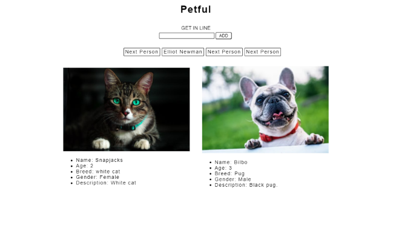

# Petful Client

## Introduction

Find cats and dogs available for adoption here onPetful! You will be able to see the next available animal ready for adoption.
We have a First-Come-First-Serve policy, because we don't like to keep out pets waiting for their new home for too long!

## Process

The app is a demo for a queue stack data structure. When the compoments mount, a timer is set for 5 seconds and a person in line is dequeued on the backend and another person is added to the queue (to simulate endless users). The user can get in line and when it is the users turn, she can adopt the next animal. If the animal list is depleted the component unmounts and displays a message. 

[Server Repo](https://github.com/themlp101/dsa-petful-server)

### Tech

---
- Tech
  - `React`
  - `Express.js`
  - `Node.js`
  - Backend stores data in JavaScript memory using a queue data structure
